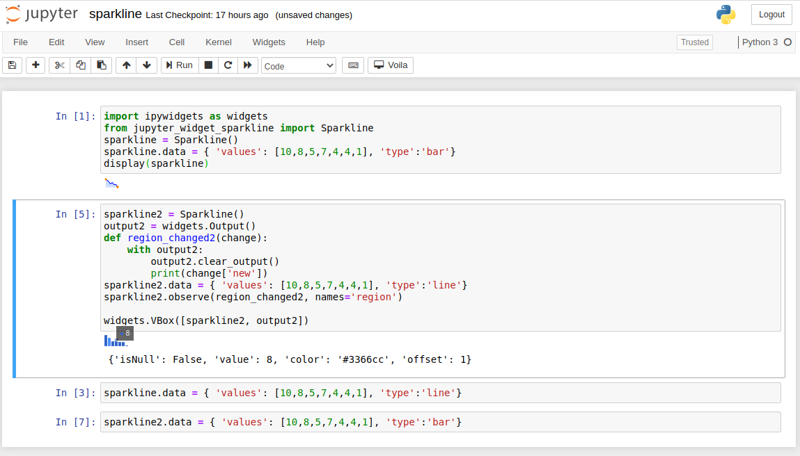

jupyter-widget-sparkline
===============================

Jupyter Widget Sparkline encapsulates [jquery Sparklines](https://omnipotent.net/jquery.sparkline/) as a jupyter notebook widget.

Options and values are passed throught the `data` field. The `region` field is updated when users click on the content of a sparkline.

Installation
------------

To install use pip:

    $ pip install jupyter_widget_sparkline
    $ jupyter nbextension enable --py --sys-prefix jupyter_widget_sparkline

To install for jupyterlab

    $ jupyter labextension install jupyter_widget_sparkline

For a development installation (requires npm),

    $ git clone https://github.com/Inria/jupyter-widget-sparkline.git
    $ cd jupyter-widget-sparkline
    $ pip install -e .
    $ jupyter nbextension install --py --symlink --sys-prefix jupyter_widget_sparkline
    $ jupyter nbextension enable --py --sys-prefix jupyter_widget_sparkline
    $ jupyter labextension install js

When actively developing your extension, build Jupyter Lab with the command:

    $ jupyter lab --watch

This takes a minute or so to get started, but then automatically rebuilds JupyterLab when your javascript changes.

Note on first `jupyter lab --watch`, you may need to touch a file to get Jupyter Lab to open.

